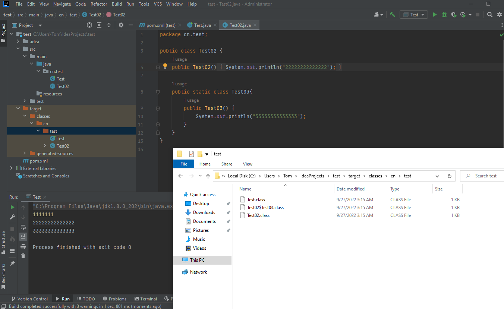
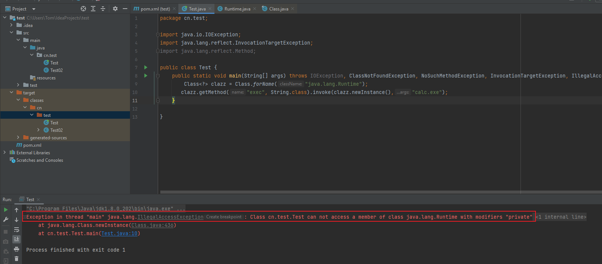
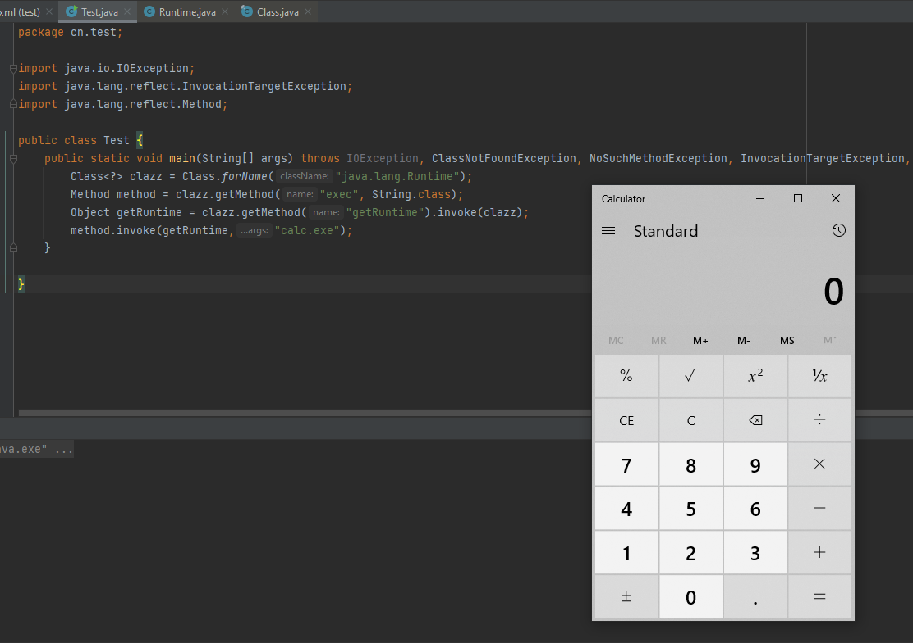
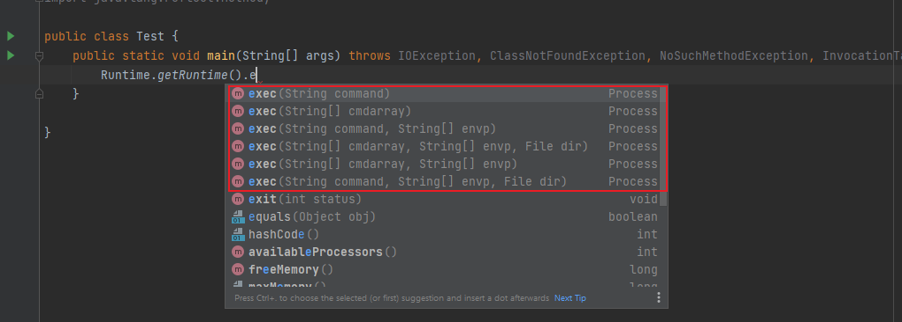

# 什么是反射

之前接触反射，不论是Java还是Go，我的理解都停留在通过参数的形式，获取属性、变量、方法、类等。感觉P神总结的更加的形象：

**P神的圣经：反射将Java这样的静态语言附加上了动态特性，动态特性含义是：一段代码，改变其中的变量，将会导致这段代码产生功能性的变化。**

# 反射的用法

```java
public void execute(String className, String methodName) throws Exception{
    Class clazz = Class.forName(ClassName);
    clazz.getMethod(methodName).invoke(clazz.newInstance());
}
```

上面例子，使用的方法的意义：

- `forName`：得到想要获取的类，并将其保存在clazz中
- `newInstance`：实例化类对象的方法
- `getMethod`：获取函数的方法
- `invoke`：执行函数的方法

因此上面`execute`函数的作用是，根据传入的类名和方法名，根据反射进行调用

## 获取类的方法

- `obj.getClass()` 当上下文存在某个类的实例`obj`，那么我们可以直接通过`obj.getClass()`来获取它的类

- `Test.class`如果你已经加载了某个类，只是想获取到它的`java.lang.Class`对象，那么久直接拿它的`class`属性即可。这个方法不属于反射
- `Class.forName`如果你知道某个类的名字，想要获取到这个类，就可以使用`forName`来获取

具体例子可以参考[Demo](https://github.com/husins/JAVA/tree/master/Reflection-Study/cn/husins/reflection)强烈建议看懂之后在往下面看，要不容易迷糊

forName有两个重载方法：

- `Class<?> forName(String name)`

- `Class<?> forName(String name, boolean initialize, ClassLoader loader)`
  - 第一个参数是完整的类路径
  - 第二个参数表示是否进行初始化
  - 第三个参数就是类加载器

**ClassLoader是什么？**它是一个 “加载器”，告诉Java虚拟机如何加载这个类。Java默认的`ClassLoader`就是根据类名来加载类，这个类名是类完整路径如`java.lang.Runtime`

**关于第二个参数的小问题：**

当运行下面这个Demo时：

```java
public class TrainPrint {
    {
    	System.out.printf("Empty block initial %s\n", this.getClass());
    }
    static {
    	System.out.printf("Static initial %s\n", TrainPrint.class);
    }
    public TrainPrint() {
    	System.out.printf("Initial %s\n", this.getClass());
    }
}
```

运行时会最先运行 `static{}`,其次是`{}`,最后是构造方法

 `static {} `就是在“类初始化”的时候调⽤用的，而`{} 中`的代码会放在构造函数的` super() `后⾯，但在当前构造函数内容的前⾯

因此当存在如下函数，参数可控时：

```java
public void ref(String name) throws Exception {
    Class.forName(name);
}
```

可以编写如下恶意类，执行恶意代码

```java
import java.lang.Runtime;
import java.lang.Process;
public class TouchFile {
static {
        try {
        Runtime rt = Runtime.getRuntime();
        String[] commands = {"touch", "/tmp/success"};
        Process pc = rt.exec(commands);
        pc.waitFor();
        } catch (Exception e) {
        // do nothing
        }
	}
}
```

# 反射获取类的优越性

在正常情况下，除了系统类，如果我们想拿到一个类，需要先`import`才能使用。而使用`forName`就不需要，这样对于我们的攻击者来说十分有利，我们可以加载任意类。

# 类名中的$的作用

[fastjson的checkAutoTypr](https://github.com/alibaba/fastjson/blob/fcc9c2a/src/main/java/com/alibaba/fastjson/parser/ParserConfig.java#L1038)中会将`$`替换成`.`。这里`$`的作用是查找内部类。

Java的普通类C1中支持编写内部类C2，而在编译的时候，会生成两个文件：`C1.class`和`C1$C2.class`，这里我们可以把他们看做是两个无关的类，通过`Class.forName("C1$C2")`即可加载这个内部类



获得类后，我们可以继续使用反射来获取这个类中的属性、方法、也可以实例化这个类，并调用方法。

# newInstance()

`class.newInstance()`的作用就是调用这个类的无参构造函数

有的时候会发生一些错误，常见原因：

- 使用的类没有无参构造
- 使用的类的构造函数时私有的

P牛直接给出的反射有些抽象，我们先来看看正向调用`java.lang.Runtime的exec`的用法

```java
package cn.test;
import java.io.IOException;

public class Test {
    public static void main(String[] args) throws IOException {
        Runtime runtime = Runtime.getRuntime();
        runtime.exec("calc.exe");
    }

}
```

由此可以写出反射的写法

```java
package cn.test;

import java.io.IOException;
import java.lang.reflect.InvocationTargetException;
import java.lang.reflect.Method;

public class Test {
    public static void main(String[] args) throws IOException, ClassNotFoundException, NoSuchMethodException, InvocationTargetException, IllegalAccessException, InstantiationException {
        Class<?> clazz = Class.forName("java.lang.Runtime");
        Method method = clazz.getMethod("exec", String.class);
        method.invoke(clazz.newInstance(),"calc.exe");
    }

}
```

对反射写法进行简化

```java
package cn.test;

import java.io.IOException;
import java.lang.reflect.InvocationTargetException;
import java.lang.reflect.Method;

public class Test {
    public static void main(String[] args) throws IOException, ClassNotFoundException, NoSuchMethodException, InvocationTargetException, IllegalAccessException, InstantiationException {
        Class<?> clazz = Class.forName("java.lang.Runtime");
       clazz.getMethod("exec", String.class).invoke(clazz.newInstance(),"calc.exe");
    }

}
```

执行反射时，会出现一个错误



这是因为`Runtime`类的构造方法是私有的

**如何解决这个问题呢？**回到最上面直接调用`Runtime`执行系统命令上面，我们通过`getRuntime`方法实例化了对象，因此我们反射调用时，也使用该方法即可

```java
package cn.test;

import java.io.IOException;
import java.lang.reflect.InvocationTargetException;
import java.lang.reflect.Method;

public class Test {
    public static void main(String[] args) throws IOException, ClassNotFoundException, NoSuchMethodException, InvocationTargetException, IllegalAccessException, InstantiationException {
        Class<?> clazz = Class.forName("java.lang.Runtime");
        Method method = clazz.getMethod("exec", String.class);
        Object getRuntime = clazz.getMethod("getRuntime").invoke(clazz);
        method.invoke(getRuntime,"calc.exe");
    }

}

// 简化payload
package cn.test;

import java.io.IOException;
import java.lang.reflect.InvocationTargetException;
import java.lang.reflect.Method;

public class Test {
    public static void main(String[] args) throws IOException, ClassNotFoundException, NoSuchMethodException, InvocationTargetException, IllegalAccessException, InstantiationException {
        Class<?> clazz = Class.forName("java.lang.Runtime");
        clazz.getMethod("exec", String.class).invoke(clazz.getMethod("getRuntime").invoke(clazz),"calc.exe");;
    }

}
```



# getMethod和invoke方法

上述例子中，可以看到`getMethod`中存在`String.class`，这个参数的作用是啥呢？

`getMethod`的作用是通过反射获取一个类的某个特定的公有方法。但是在Java中支持类的重载，我们不能仅通过函数名来确定一个函数，还需要传递对应的类型和数量的参数，来保证调用方法的唯一性。所以，在调用`getMethod`的时候，我们需要传给他你需要获取的函数的参数类型列表。

比如刚才调用的`exec`,它被重载了六次，不传递参数，无法保证其唯一性：



因此当我们选择`exec(String command)`时，写法为：`getMethod("exec",String.class)`,保证调用函数的唯一性

`invoke`方法的作用是执行方法，参数分为两部分，第一个参数：

- 如果这个方法是一个普通方法，那么第一个参数是类对象
- 如果这个方法是一个静态方法，那么第一个参数是类

其余参数是方法所需要的参数。

# 类没有无参构造时

**如果一个类没有无参构造方法，也没有类似当立模式里面的静态方法，如何通过反射实例化该类呢？**

这里需要用到一个新的反射方法`getConstructor`，该方法用来获取类内的构造方法，接收的参数是构造函数列表类型，因为构造函数也支持重载，所以必须用参数列表类型才能保证调用的唯一性。

这里P牛使用执行命令的方式是`ProcessBuilder`，先正向梳理一遍执行命令的过程，首先该类有两个构造方法：

- ProcessBuilder(List<String> command) ：利用指定的操作系统程序和参数构造一个进程生成器。
-  ProcessBuilder(String… command) ：利用指定的操作系统程序和参数构造一个进程生成器。

具体过程如下：

```java
package cn.test;


import java.io.IOException;
import java.util.ArrayList;
import java.util.List;

public class Test {
    public static void main(String[] args) throws IOException {
        List<String> cmds = new ArrayList<>();
        cmds.add("calc.exe");
        ProcessBuilder builder = new ProcessBuilder(cmds);
        builder.start();
    }

}
```

由此可以编写反射写法：

```java
package cn.test;


import java.io.IOException;
import java.lang.reflect.Constructor;
import java.lang.reflect.InvocationTargetException;
import java.util.ArrayList;
import java.util.Arrays;
import java.util.List;

public class Test {
    public static void main(String[] args) throws IOException, ClassNotFoundException, NoSuchMethodException, InvocationTargetException, InstantiationException, IllegalAccessException {
        Class<?> clazz = Class.forName("java.lang.ProcessBuilder");
        Constructor<?> constructor = clazz.getConstructor(List.class);
        ProcessBuilder o = (ProcessBuilder) constructor.newInstance(Arrays.asList("calc.exe"));
        o.start();
    }
}

// 简化payload
package cn.test;


import java.io.IOException;
import java.lang.reflect.InvocationTargetException;
import java.util.Arrays;
import java.util.List;

public class Test {
    public static void main(String[] args) throws IOException, ClassNotFoundException, NoSuchMethodException, InvocationTargetException, InstantiationException, IllegalAccessException {
        Class<?> clazz = Class.forName("java.lang.ProcessBuilder");
        ((ProcessBuilder)  clazz.getConstructor(List.class).newInstance(Arrays.asList("calc.exe"))).start();
    }
}
```

这里又存在一个问题，就是payload中用到了类型强转，有时候我们利用漏洞的时候（在表达式上线文中）是没有这种语法的。所以，要用反射来完成类型强转

思路：直接执行`start`方法，将执行对象传入进去，不需要类型强转

```java
package cn.test;


import java.io.IOException;
import java.lang.reflect.Constructor;
import java.lang.reflect.InvocationTargetException;
import java.util.Arrays;
import java.util.List;

public class Test {
    public static void main(String[] args) throws IOException, ClassNotFoundException, NoSuchMethodException, InvocationTargetException, InstantiationException, IllegalAccessException {
        Class<?> clazz = Class.forName("java.lang.ProcessBuilder");
        Constructor<?> constructor = clazz.getConstructor(List.class);
        Object o = constructor.newInstance(Arrays.asList("calc.exe"));
        clazz.getMethod("start").invoke(o);
    }
}

// 简化payload
package cn.test;


import java.io.IOException;
import java.lang.reflect.Constructor;
import java.lang.reflect.InvocationTargetException;
import java.util.Arrays;
import java.util.List;

public class Test {
    public static void main(String[] args) throws IOException, ClassNotFoundException, NoSuchMethodException, InvocationTargetException, InstantiationException, IllegalAccessException {
        Class<?> clazz = Class.forName("java.lang.ProcessBuilder");
        clazz.getMethod("start").invoke(clazz.getConstructor(List.class).newInstance(Arrays.asList("calc.exe")));
    }
}
```

原理其实就是利用invoke第一个参数是类或者类对象即可，并不强调类型。

利用`ProcessBuilder`的第二个构造方法如何通过反射进行命令执行呢？

这里涉及到Java的可变长参数，当你定义函数的时候不确定参数数量时，可以使用`...`这样的语法来表示“这个函数的参数个数是可变的”。

对于可变长参数，java在底层编译时会将其编译成一个数组，也就是说，如下两种方式在底层是等价的

```java
public void hello(String[] names){}
public void hello(String...names){}
```

由此，如果一个数组想要传递给hello函数，直接传递即可

```java
String[] names = {"hello","world"};
hello(names);
```

因此，对于反射来说，如果我们要获取目标函数里包含可变长参数，将其看做数组即可。

编写利用`ProcessBuilder`第二个构造参数的反射如下：

```java
package cn.test;

import java.io.IOException;
import java.lang.reflect.Constructor;
import java.lang.reflect.InvocationTargetException;
import java.util.Arrays;
import java.util.List;

public class Test {
    public static void main(String[] args) throws IOException, ClassNotFoundException, NoSuchMethodException, InvocationTargetException, InstantiationException, IllegalAccessException {
        Class<?> clazz = Class.forName("java.lang.ProcessBuilder");
        Constructor<?> constructor = clazz.getConstructor(String[].class);
        ProcessBuilder o = (ProcessBuilder)constructor.newInstance((new String[][]{{"calc.exe"}}));
        o.start();
    }
}

// 简化payload
package cn.test;


import java.io.IOException;
import java.lang.reflect.InvocationTargetException;

public class Test {
    public static void main(String[] args) throws IOException, ClassNotFoundException, NoSuchMethodException, InvocationTargetException, InstantiationException, IllegalAccessException {
        Class<?> clazz = Class.forName("java.lang.ProcessBuilder");
        ((ProcessBuilder)clazz.getConstructor(String[].class).newInstance((new String[][]{{"calc.exe"}}))).start();
    }
}
```

这里需要注意两点：

- 在调用 `newInstance` 的时候，因为这个函数本身接收的是一个可变长参数，我们传给
  `ProcessBuilder` 的也是一个可变长参数，二者叠加为一个二维数组

- 在生成二维数组时，要用`java.lang.String`包下的`String`实例化对象

# 方法私有化时

**如果一个方法或构造方法是私有方法，我们是否能执行它呢？**

解决这个问题，就需要涉及到`getDeclared`系列的反射，与上述介绍的方法的区别：

- `getMethod` 系列方法获取的是当前类中所有公共方法，包括从父类继承的方法

- `getDeclaredMethod`系列方法获取的是当前类中“声明”的方法，是实在写在这个类里的，包括私有的方法，但从父类里继承来的就不包含了

具体的Demo，可以参考最上面给出的Demo链接

举个例子，前文我们说过Runtime这个类的构造函数是私有的，我们需要用 `Runtime.getRuntime()` 来获取对象。其实现在我们也可以直接用` getDeclaredConstructor `来获取这个私有的构造方法来实例化对象，进而执行命令：

```java
Class clazz = Class.forName("java.lang.Runtime");
Constructor m = clazz.getDeclaredConstructor();
m.setAccessible(true);
clazz.getMethod("exec", String.class).invoke(m.newInstance(), "calc.exe");
```


