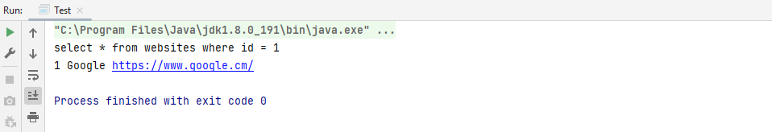
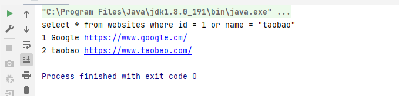

# 前置

- 在java项目中常见的连接数据库的方式有三种

  - JDBC
  - Mybatis
  - Hibernate

- >  在学习Java的SQL注入之前思考一个问题，Java和PHP的SQL注入就本质来说有区别吗？
  >
  > SQL注入产生的原因，是在利用编程语言动态生成SQL语句的过程中，通过传递恶意的SQL语句，使得最终执行的SQL语句，产生预期之外的执行结果。因此，SQL注入和编程语言并没有直接关系，但是编程语言生成动态SQL的语法不同，可能会导致一些利用方式上的差异

# JDBC

- 首先使用IDEA创建一个Maven项目

- ```xml
  <!--在pom.xml进行如下配置-->
  <?xml version="1.0" encoding="UTF-8"?>
  <project xmlns="http://maven.apache.org/POM/4.0.0"
           xmlns:xsi="http://www.w3.org/2001/XMLSchema-instance"
           xsi:schemaLocation="http://maven.apache.org/POM/4.0.0 http://maven.apache.org/xsd/maven-4.0.0.xsd">
      <modelVersion>4.0.0</modelVersion>
  
      <groupId>cn.test</groupId>
      <artifactId>sql_demo</artifactId>
      <version>1.0-SNAPSHOT</version>
  
      <properties>
          <maven.compiler.source>8</maven.compiler.source>
          <maven.compiler.target>8</maven.compiler.target>
      </properties>
      <!--引入连接mysql的JDBC依赖-->
      <dependencies>
          <dependency>
              <groupId>mysql</groupId>
              <artifactId>mysql-connector-java</artifactId>
              <version>5.1.47</version>
          </dependency>
      </dependencies>
  </project>
  ```

- ```java
  // 构建如下demo
  package cn.test;
  
  import java.sql.*;
  
  public class Test {
      public static String Driver = "com.mysql.jdbc.Driver";
      public static String URL = "jdbc:mysql://localhost:3306/Runoob";
      public static String Username = "root";
      public static String Password = "root";
      public static void main(String[] args) throws ClassNotFoundException, SQLException {
          //利用反射注册JDBC驱动
          Class.forName(Driver);
          Connection conn = DriverManager.getConnection(URL, Username, Password);
          ResultSet res = mySelect(conn, "1");
          sout(res);
          res.close();
          conn.close();
  
      }
  
      public static ResultSet mySelect(Connection conn,String id) throws SQLException {
          String sql = "select * from websites where id = " + id;
          System.out.println(sql);
          Statement statement = conn.createStatement();
          ResultSet res = statement.executeQuery(sql);
          return res;
      }
  
      public static void sout(ResultSet res) throws SQLException {
          while (res.next()){
              System.out.println(res.getInt("id")+" "+res.getString("name")+" "+res.getString("url"));
          }
      }
  }
  ```

  当我们正常执行时，结果如下：

  

​	当我们修改`ResultSet res = mySelect(conn, "1");`值的时候（这里假设“1” 是我们可控的传参点），当修改为`1 or name = "taobao"`时：



这就是一个很明显的SQL注入，为了避免SQL注入的产生，Java提供了预编译的解决方案。

预编译Demo如下：

```java
package cn.test;

import java.sql.*;

public class PerpareStatementTest {
    public static String Driver = "com.mysql.jdbc.Driver";
    public static String URL = "jdbc:mysql://localhost:3306/Runoob";
    public static String Username = "root";
    public static String Password = "root";
    public static void main(String[] args) throws ClassNotFoundException, SQLException {
        //利用反射注册JDBC驱动
        Class.forName(Driver);
        Connection conn = DriverManager.getConnection(URL, Username, Password);
        ResultSet res = mySelect(conn, "1 or 1");
        sout(res);
        res.close();
        conn.close();

    }

    public static ResultSet mySelect(Connection conn,String id) throws SQLException {
        String sql = "select * from websites where id = ?";
        PreparedStatement statement = conn.prepareStatement(sql);
        statement.setString(1,id);
        ResultSet res = statement.executeQuery();
        return res;
    }

    public static void sout(ResultSet res) throws SQLException {
        while (res.next()){
            System.out.println(res.getInt("id")+" "+res.getString("name")+" "+res.getString("url"));
        }
    }
}
```

原理很简单：JDBC在处理SQL语句时有一个预编译的过程，而预编译对象就是把一些格式固定的SQL编译后，存放在内存池中即JDBC缓冲池，当我们**再次执行相同的SQL语句时就不需要预编译的过程了，所以即使SQL注入特殊的语句，也会只当做参数传进去，不会当做指令执行**。

这里又几个点需要关注：

- 预编译如何让传递的数据一定当做参数，而不是指令？核心就是用单引号包裹我们传递进去的数据，为了避免产生歧义，我们传入的单引号等字符，会自动被反斜杠转义，这时会产生数字型的注入不在存在，字符型注入，逃逸不掉单引号，只会被当做参数处理

  也就是说我们上面Demo最终执行的sql语句为

  `select * from websites where id = '1 or 1'`

当预编译语句中出现`order by` 或者`group by`时，会产生一个问题

`order by`后一般是接字段名，而字段名是不能带引号的，比如 `order by username`；如果带上引号成了`order by 'username'`，那username就是一个字符串不是字段名了，这就产生了语法错误

同样`group by`也存在同样的问题

也就是说，当使用`order by` 和 `group by`时，必须要使用`Statement`方式才可以

- 使用预编译就一定不会产生SQL注入吗？答案是否定的，当不规范的使用预编译时，SQL注入仍然会产生

```java
String sql = "select * from websites where id =" + id;
PreparedStatement statement = conn.prepareStatement(sql);
ResultSet res = statement.executeQuery();
```

如上，当代码没有按照预编译规范使用时，会造成恶意语句直接被预编译，也就失去了预编译的效果。

# Mybites和Hibernate

这些ORM框架模型核心还是离不开最基本的`Preparestatement`和`Statement`只不过进行了简单的封装罢了

众所周知`Mybites`的map中有两种配置方式`${}`和`#{}`

其实`${}`就是调用了JDBC的`Statement`，`#{}`就是调用了JDBC的`Preparestatement`,只不过单引号包裹变成了双引号包裹。


而Hibernate支持两种SQL语句的写法

- 原生SQL语句，这也是回到了JDBC，该咋注入就咋注入，因为是直接拼接的
- 使用hql的方式执行SQL语句，常见写法如下

```java
// 位置参数
String parameter = "g1ts";
Query<User> query = session.createQuery("from users name = ?1", User.class);
query.setParameter(1, parameter);

// 命名参数
Query<User> query = session.createQuery("from users name = ?1", User.class);
String parameter = "g1ts";
Query<User> query = session.createQuery("from users name = :name", User.class);
query.setParameter("name", parameter);

// 命名参数列表
List<String> names = Arrays.asList("g1ts", "g2ts");
Query<User> query = session.createQuery("from users where name in (:names)", User.class);
query.setParameter("names", names);

// 类实例
user1.setName("g1ts");
Query<User> query = session.createQuery("from users where name =:name", User.class);
query.setProperties(user1);
```

看了写法，不难发现还是JDBC预编译那一套，写好预编译语句留好占位符，就是支持传入的参数多了一点，没啥可说的了，因此即使不同框架，核心还是JDBC的那些东西。
